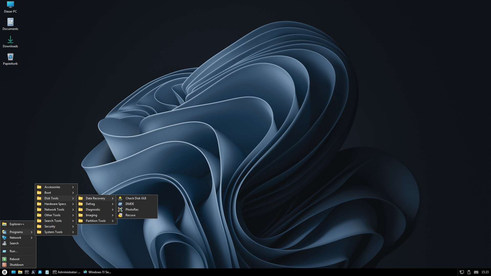
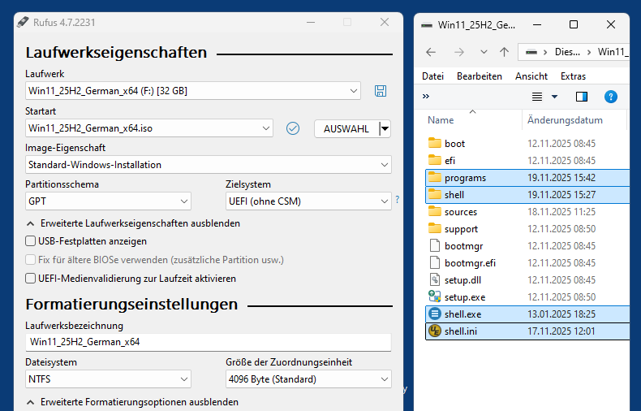
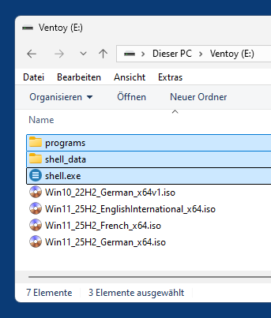

# WinSetupShell (Win11PE)

WinSetupShell is a simple [desktop shell](https://en.wikipedia.org/wiki/Windows_shell) (start menu, quick launch toolbar, taskbar, system tray) for [Windows PE](https://en.wikipedia.org/wiki/Windows_Preinstallation_Environment) x64 written in [Python](https://www.python.org/) that can be used to enhance a regular Windows 11 (or Windows 10 22H2) setup USB drive with a [live USB system](https://en.wikipedia.org/wiki/Live_USB) that can optionally be used for system repair tasks etc., using a comfortable desktop GUI instead of only hacking commands into a CMD prompt. It provides network support (via [PENetwork](https://www.penetworkmanager.de/)) and a web browser ([Firefox](https://www.firefox.com/)), so you can search for documentation or download stuff right from the live USB system, no other PC needed.

WinSetupShell uses the original unaltered Windows PE that comes with the Windows setup, there is no "baking" involved. Windows PE is a reduced Windows OS that provides the basic WinAPI, but no Explorer file manager, and no Explorer-based desktop, therefor such a custom shell/desktop is needed. As file manager a customized version of [Explorer++](https://github.com/derceg/explorerplusplus) is used.

**The original Windows setup stuff isn't altered in any way, so the USB drive remains a perfectly valid Windows setup media**.

WinSetupShell is a simple and easily installed alternative for applications like [WinBuilder](https://en.wikipedia.org/wiki/WinBuilder), [Win10XPE](https://theoven.org/), [PEBakery](https://github.com/pebakery/pebakery) etc., which are way too complicate for me.

As far as I know it's the only [alternative shell for Windows](https://en.wikipedia.org/wiki/List_of_alternative_shells_for_Windows) that was ever written in Python. But, why not?

*WinSetupShell desktop, loaded from enhanced Win11 25H2 USB setup media*  

## Requirements

- [Rufus](https://rufus.ie/en/) (or some similar tool)
- USB drive (10 GB or larger)

## Setup

- Use Rufus to download and install a Windows 11 setup .iso of the flavor and language of your choice (I used `Win11_25H2_German_x64.iso`) on the USB drive, turning it into a regular Windows 11 setup media. Or let Rufus use a local .iso file that you downloaded before.
- Download the lastest `WinSetupShell` release .7z, unpack it and copy its contents (`shell.exe` and the 2 folders `shell_data` and `programs`) to the root directory of the USB drive.
- Done.

*Windows 11 setup USB drive created with Rufus, with the 3 additional WinSetupShell items copied to it*  

## Alternative Setup (Ventoy)

WinSetupShell can also be used with a multi-boot USB drive created with [Ventoy](https://www.ventoy.net/en/index.html). In this case just copy `shell.exe` and the 2 folders `shell_data` and `programs` on the Ventoy volume, next to your (Windows setup) .iso files.

*Ventoy USB drive with 4 Windows Setup .iso files and the 3 WinSetupShell items*  

## Usage

- Boot from the enhanced Windows 11 setup USB drive. If you want to install Windows on the local PC, continue as usual. But if you instead want to (first) start the live system, see below.

- When you see the Windows 11 Setup window, press `Shift+F10` to open a CMD prompt.

- Enter `D:\shell` to start the shell. [*]

- You can quit the shell by right-clicking on the start menu button and selecting "Quit" from the popup menu, you will then return to the naked Windows 11 setup window and can continue the Windows setup. Or select "Reboot" or "Shutdown" in the start menu to reboot resp. shut down the PC.

[*] "D" is a placeholder for the actual drive letter of your USB drive (NOT the drive letter of the booted system, loaded from boot.wim, which AFAIK is always "X"). It will be the first letter, starting at "C", that is not used by existing volumes on your PC. If there are no (valid) volumes with drive letters, it will be "C", in my case it's "D". You can enter `echo list vol | diskpart` to see a list of all existing volumes and their letters.

## Network

Network isn't started by default, so before you can use e.g. Firefox or FileZilla, you first have to initialize it, either by clicking on the network icon in the system tray or selecting `Network -> Initialize Network` from the start menu. If you are connected via Ethernet cable and DHCP is available, nothing else is needed, you should now be online.

If you want to start network by default, add line  
`wpeutil.exe InitializeNetwork`  
to the end of file  
`shell_data\userprofile\AppData\autoexec.bat`.

## Hotkeys

- Win: Toggle start menu
- Win + Alt + Del: Open Task Manager (Ctrl+Alt+Del doesn't work in PE and AFAIK can't be overwritten)
- Win + D: Show desktop (toggle visible application windows)
- Win + E: Open new Explorer++ instance/window
- Win + R: Open "Run" dialog
- Win + S: Open Search (defaults to SwiftSearch) 

## Included applications (Freeware/Shareware/Trialware)

- [7-Zip](https://www.7-zip.org/)
- [AgentRansack](https://www.mythicsoft.com/agentransack/)
- [BootIce](https://www.majorgeeks.com/files/details/bootice_64_bit.html)
- [Check Disk GUI](https://alternativeto.net/software/chkdsk-gui/about/)
- [Classic Calulator](https://win7games.com/#calc)
- [CPU-Z](https://www.cpuid.com/softwares/cpu-z.html)
- [Crystal Disk Info](https://crystalmark.info/en/software/crystaldiskinfo/)
- [Defraggler](https://www.ccleaner.com/defraggler)
- [DiskGenius](https://www.diskgenius.com/)
- [DMDE](https://dmde.com/)
- [Drive Snapshot](http://www.drivesnapshot.de/en/)
- [EasyUEFI](https://www.easyuefi.com/) (Trial version)
- [Explorer++](https://explorerplusplus.com/)
- [FileZilla](https://filezilla-project.org/)
- [Firefox](https://www.firefox.com/)
- [GSmartControl](https://gsmartcontrol.shaduri.dev/)
- [HWiNFO](https://www.hwinfo.com/download/)
- [HxD](https://mh-nexus.de/de/hxd/)
- [IrfanView](https://www.irfanview.com/)
- [IsoBuster](https://www.isobuster.com/)
- [Macrium Reflect](https://www.macrium.com/reflectfree) (Trial version)
- [MiniTool Partition Wizard](https://www.minitool.com/partition-manager/)
- [NirSoft (suite)](https://www.nirsoft.net/)
- [Notepad++](https://notepad-plus-plus.org/)
- [NTPWedit](http://www.cdslow.org.ru/en/ntpwedit/)
- [PENetwork](https://www.penetworkmanager.de/)
- [PortableGit](https://git-scm.com/install/windows) (Git Bash, Git CMD)
- [PowerISO](https://www.poweriso.com/)
- [PowerShell 7](https://github.com/PowerShell/PowerShell)
- [PuTTY](https://www.chiark.greenend.org.uk/~sgtatham/putty/)
- [Python 3.12.10](https://python.org)
- [Recuva](https://www.ccleaner.com/recuva)
- [Rufus](https://rufus.ie/en/)
- [Speccy](https://www.ccleaner.com/speccy)
- [SumatraPDF](https://www.sumatrapdfreader.org/free-pdf-reader)
- [SwiftSearch](https://www.majorgeeks.com/files/details/swiftsearch.html)
- [Sysinternals Suite](https://learn.microsoft.com/en-us/sysinternals/downloads/sysinternals-suite)
- [TestDisk & PhotoRec](https://www.cgsecurity.org/wiki/TestDisk)
- [Total Commander](https://www.ghisler.com/index.htm) (with plugin [DiskInternals Reader](https://www.diskinternals.com/reader-for-tc/), which allows to explore Linux and Mac partitions and disk images)
- [UltraSearch](https://www.jam-software.com/ultrasearch)
- [VeraCrypt](https://veracrypt.io/en/Home.html) (TrueCrypt fork and successor)
- [VhdManager](https://www.sordum.org/8705/simple-vhd-manager-v1-5/)
- [Windows Login Unlocker](https://archive.org/details/windows.-login.-unlocker.-wlu.v-2.1.-pe-10.x-64_202408)
- [WordPad](https://en.wikipedia.org/wiki/WordPad) (classic)

## Notes

- Windows PE doesn't provide shell notications for file system changes. That's why in Explorer++ you have to explicitely refresh the current view (with F5) after deleting or moving files etc. WinSetupShell tries to circumvent this issue for its desktop as effectively as possible, but there are still some occasions where you have to refresh manually to update the view.

- WinSetupShell is meant for Windows PE as provided by Windows 11 setup media, but for testing purposes it can also be run inside a regular Windows 11 system. Just unpack the release .7z and start "shell.exe". The shell (desktop) will then run fullscreen on top of the regular Windows desktop. You can quit it by right-clicking on the start menu button and selecting "Exit" from the popup menu.

- The shell itself, which only uses a few words like "Start", "Reboot", "Shutdown" and "Exit", is english only, no localisation (since I don't care). But shell items on the desktop and the time/date format in the clock are localized, and many of the provided applications are as well.

- You can of course save files either on the USB drive or preexisting volumes on the local PC, but there is no persistance concerning registry changes etc. Which is actually a good thing, "boot.wim" is never altered, so you can't mess up the actual installation media (unless you alter it manually e.g. by using included 7-zip, which can load and save .wim files)

- There is no UAC, you are always user `SYSTEM` with elevated access.

- No sound/video/multimedia (IMHO pointless for a system repair live system)

- No 32-bit support, only 64-bit binaries are supported.

- Only portable x64 applications based on the plain WinAPI can be used, so no .NET, UWP etc.

- There might be issues with some HiDPI displays.

- WinSetupShell can also be used with Windows 10 22H2 setup media instead of Windows 11, but not all provided programs will work. In particular PortableGit and TestDisk fail in the Windows 10 setup PE.

## Customization

Additional compatible (64-bit, portable and WinAPI only) applications can be added to folder `programs` on the USB drive. Links to them can then be added to the start menu by adding them to JSON-like text file  
`shell_data\userprofile\AppData\start_menu.pson`  
using an arbitrary text editor. The format should be self-explanatory, here some hints: 

- Like in JSON (or JS or C...), backslashes in pathes have to be doubled.

- It's important that .exe paths in this file are never absolute (since the drive letter at runtime is not fixed), but instead either start with `%programs%\\...` or `%windir%\\...`, which will then be evaluated at runtime.

- Menu separators are represented by a "-".

- The "Search" item at the root of the start menu by default starts `SwiftSearch`, but feel free to edit its item to make it point to one of the other provided search apps (`AgentRansack`, `SearchMyFiles`, `UltraSearch`) instead.

- Instead of using an exe's default icon - or for start menu commands based on CMD or PowerShell scripts, so without their own icon - you can either append a system icon index to the menu item's list, the icon will then be loaded from shell32.dll using the specified icon index. Or put your own .ico file into folder  
`shell_data\userprofile\AppData\custom_icons`  
and append its filename to the menu item's list.

- If you want to pass parameters to an executable, separate the full command line from the executable by a single comma.

Examples:

 - Start menu item with parameters:  
  `["CMD", "%windir%\\System32\\cmd.exe,/k dir"]`

- Same as above, but this time using the globe icon from shell32.dll:  
  `["CMD", "%windir%\\System32\\cmd.exe,/k dir", 14]`

- Same as above, but his time using a custom icon loaded from a .ico file in `custom_icons`:  
  `["CMD", "%windir%\\System32\\cmd.exe,/k dir", "my-fancy-icon.ico"]`

To add or remove applications to/from the quick launch toolbar, edit file  
`shell_data\userprofile\AppData\quick_launch.pson`  
accordingly.

Since the Windows PE system doesn't provide persistant icon caching, WinSetupShell uses custom caching to speed up its start. Therefor, whenever you changed something in the start menu or quick launch toolbar, you have to delete the folder  
`shell_data\userprofile\AppData\icon_cache`  
or its contents on the USB drive. The cache will then be rebuilt when the shell is started for the next time (which will take a couple of seconds).

You can change the wallpaper by replacing file  
`shell_data\userprofile\AppData\wallpaper.jpg`  
with a different .jpg file with this file name. The wallpaper is always scaled to the current desktop dimensions, but never distorted, so it might be cropped if needed.

If you prefer a plain desktop background color, simply remove/rename `wallpaper.jpg`. The background color defaults to some warmish dark blue, but can be changed by editing file  
`shell_data\userprofile\AppData\config.pson`.  
This config file also allows to change various other settings, like e.g. activating light mode instead of dark mode (for taskbar, menus and tooltips).
