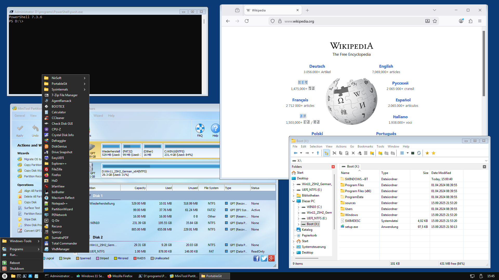

# WinSetupShell (Win11PE)

WinSetupShell is a simple desktop shell (start menu, quick launch toolbar, taskbar, system tray) for [Windows PE](https://en.wikipedia.org/wiki/Windows_Preinstallation_Environment) x64 written in Python that can be used to enhance a regular Windows 11 (or Windows 10 22H2) setup USB flash drive with a [live USB system](https://en.wikipedia.org/wiki/Live_USB) that can optionally be used for system repair tasks etc., using a comfortable desktop GUI instead of only hacking commands into a CMD prompt. It provides network support (via [PENetwork](https://www.penetworkmanager.de/)) and a web browser ([Firefox](https://www.firefox.com/)), so you can search for documentation or download stuff right from the live USB system, no other PC needed.

WinSetupShell uses the original unaltered Windows PE that comes with the Windows setup, there is no "baking" involved. Windows PE is a reduced Windows OS that provides the basic WinAPI, but no Explorer file manager, and no Explorer-based desktop, therefor such a custom shell/desktop is needed. As file manager a customized version of [Explorer++](https://github.com/derceg/explorerplusplus) is used.

The original Windows setup stuff isn't altered in any way, so the USB flash drive remains a perfectly valid Windows setup media.

WinSetupShell is a simple and easily installed alternative for applications like [WinBuilder](https://en.wikipedia.org/wiki/WinBuilder), [Win10XPE](https://theoven.org/), [PEBakery](https://github.com/pebakery/pebakery) etc., which are way too complicate for me ;-)

*WinSetupShell desktop - loaded from enhanced Win11 25H2 USB setup media - with various applications running*  

## Requirements

- [Rufus](https://rufus.ie/en/) (or some similar tool)
- USB flash drive (10 GB or larger)

## Setup

- Use Rufus to download and install a Windows 11 setup .iso of the flavor and language of your choice (I used `Win11_25H2_German_x64.iso`) on the USB flash drive, turning it into a regular Windows 11 setup media. Or let Rufus use a local .iso file that you downloaded before.
- Download the lastest `WinSetupShell` release .7z, unpack it and copy its contents (`shell.exe` and the 2 folders `shell_data` and `programs`) to the root directory of the USB flash drive.
- Done.

*Windows 11 setup USB flash drive created with Rufus, with the 3 additional WinSetupShell items copied to it*  

## Usage

- Boot from the enhanced Windows 11 setup flash drive. If you want to install Windows on the local PC, continue as usual. But if you instead want to (first) start the live system, see below.

- When you see the Windows 11 Setup window, press `Shift+F10` to open a CMD prompt.

- Enter `D:\shell` to start the shell. [*]

- You can quit the shell by right-clicking on the start menu button and selecting "Quit" from the popup menu, you will then return to the naked Windows 11 setup window and can continue the Windows setup. Or select "Reboot" or "Shutdown" in the start menu to reboot resp. shut down the PC.

[*] "D" is a placeholder for the actual drive letter of your USB flash drive (NOT the drive letter of the booted system, loaded from boot.wim, which AFAIK is always "X"). It will be the first letter, starting at "C", that is not used by existing volumes on your PC. If there are no (valid) volumes with drive letters, it will be "C", in my case it's "D". You can enter `echo list vol | diskpart` to see a list of all existing volumes and their letters.

## Network

Network isn't started by default, so before you can use e.g. Firefox or FileZilla, you first have to initialize it, either by clicking on the network icon in the system tray or selecting `PENetwork` from the start menu, both do the same thing, they start `PENetwork`. If you are connected via Ethernet cable and DHCP is available, nothing else is needed, you should now be online.

If you want to start network by default, add line `"%programs%\\PENetwork\\PENetwork.exe"` to JSON-like config file  
`shell_data\app_data\startup.pson`.

## Included applications (Freeware/Shareware/Trialware)
- 7-Zip
- AgentRansack
- BootIce
- Check Disk GUI
- CPU-Z
- Crystal Disk Info
- Defraggler
- DiskGenius
- Drive Snapshots
- EasyUEFI (Trial)
- Explorer++
- FileZilla
- Firefox
- HWiNFO
- HxD
- IrfanView
- IsoBuster
- Macrium Reflect
- MiniTool Partition Wizard
- NirSoft (suite)
- Notepad++
- PENetwork
- PortableGit (Git Bash, Git CMD)
- PowerShell 7
- Q-Dir
- Recuva
- Rufus
- Speccy
- SumatraPDF
- SwiftSearch
- SysinternalsSuite
- TestDisk & PhotoRec
- Total Commander (with plugin "DiskInternals Reader", which allows to explore Linux and Mac partitions and disk images)
- VeryCrypt
- VhdManager
- Windows Login Unlocker

## Notes
- WinSetupShell is meant for Windows PE as provided by Windows 11 setup media, but for testing purposes it can also be run inside a regular Windows 11 system. Just unpack the release .7z and start "shell.exe". The shell (desktop) will then run fullscreen on top of the regular Windows desktop. You can quit it by right-clicking on the start menu button and selecting "Quit" from the popup menu.

- The shell itself, which only uses a couple of words like "Start", "Shutdown" and "Quit", is english only, no localisation (since I don't care). But time and date formats in the clock are localized, and various applications, either by Microsoft or 3rd party, are as well.

- You can of course save files either on the USB flash drive or preexisting volumes on the local PC, but there is no persistance concerning registry changes etc. Which is actually a good thing, "boot.wim" is never altered, so you can't mess up the actual installation media (unless you alter it manually e.g. by using included 7-zip, which can load and save .wim files)

- There is no UAC, you are always user `Administrator` with elevated access.

- No sound/video/multimedia (IMHO pointless for a system repair live system)

- No 32-bit support, only 64-bit binaries are supported.

- Only portable x64 applications based on the plain WinAPI can be used, so no .NET, UWP etc.

- There might be issues with some HiDPI displays.

## Customization

Additional compatible (64-bit, portable and WinAPI only) applications can be added to folder `programs` on the USB flash drive. Links to them can then be added to the start menu by adding them to JSON-like text file  
`shell_data\app_data\start_menu.pson`  
using an arbitrary text editor. The format should be self-explanatory. It's important that .exe paths in this file are never absolute (since the drive letter at runtime is not fixed), but instead either start with `%programs%\...` or `%windir%\...`, which will then be evaluated at runtime.  

To add or remove applications to/from the quick launch toolbar, edit text file  
`shell_data\app_data\quick_launch.pson`  
accordingly.
